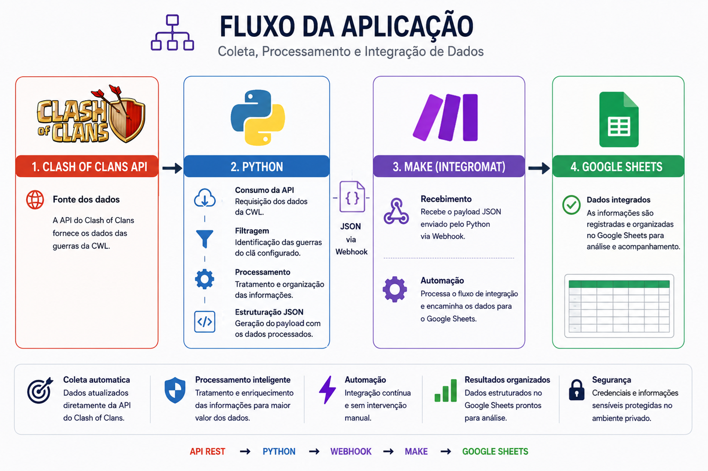

# Sistema de Automação e Integração de Dados

Projeto desenvolvido em **Python** para coleta, processamento e integração de dados utilizando uma **API REST**, **Webhooks**, **Make (Integromat)** e **Google Sheets**.

O sistema utiliza a API do Clash of Clans como fonte de dados e realiza o processamento das informações antes de enviá-las para uma automação no Make, responsável pela integração com o Google Sheets.

> **Observação:** O código-fonte e as configurações internas deste projeto não são disponibilizados publicamente. Este repositório tem como objetivo apresentar a arquitetura, as tecnologias utilizadas e o funcionamento geral da solução.

---

## 🔄 Fluxo da aplicação

A solução utiliza a seguinte arquitetura:

**Clash of Clans API → Python → Webhook → Make → Google Sheets**

## 🛠️ Tecnologias utilizadas
- Python
- Requests
- API REST
- Webhooks
- Make (Integromat)
- Google Sheets

## ⚙️ Funcionamento

O sistema realiza as seguintes etapas:

1. O Python realiza uma requisição à API do Clash of Clans.
2. Os dados da CWL são recebidos pela aplicação.
3. O sistema identifica as guerras relacionadas ao clã configurado.
4. Os dados da guerra selecionada são processados e organizados.
5. Informações dos jogadores, ataques, defesas e níveis de Centro de Vila são tratadas.
6. Informações adicionais são calculadas e associadas aos dados recebidos.
7. Os registros são estruturados em um payload JSON.
8. O payload é enviado para um Webhook do Make.
9. O Make recebe e processa os dados.
10. As informações são integradas ao Google Sheets.

## 📊 Processamento dos dados

Entre os dados processados pelo sistema estão:

- informações da guerra;
- temporada da CWL;
- liga do clã;
- identificação do clã participante;
- identificação do clã adversário;
- membros participantes;
- níveis de Centro de Vila (TH);
- ataques realizados;
- ataques recebidos;
- estrelas obtidas;
- percentual de destruição;
- duração dos ataques;
- diferença entre o TH do atacante e do defensor;
- informações visuais relacionadas à liga e ao clã.

## 🔗 Integrações

A arquitetura principal da solução é:

## API REST → Python → Webhook → Make → Google Sheets

O Python é responsável pela coleta e pelo processamento dos dados, enquanto o Make realiza a automação e a integração com o Google Sheets.

## 🎯 Objetivo do projeto

O projeto foi desenvolvido como uma aplicação prática para trabalhar conceitos de:

- desenvolvimento com Python;
- consumo de APIs REST;
- requisições HTTP;
- tratamento e transformação de dados;
- automação de processos;
- integração entre sistemas;
- utilização de Webhooks;
- comunicação entre diferentes serviços.

## 📷 Demonstração

Imagens e exemplos do funcionamento da solução serão apresentados nesta seção.

## 🔐 Privacidade e segurança

Por questões de segurança, o código-fonte, tokens, credenciais, URLs privadas e configurações internas da aplicação não são disponibilizados neste repositório.

O conteúdo publicado possui finalidade demonstrativa e apresenta a arquitetura, as tecnologias e o funcionamento geral do projeto.
